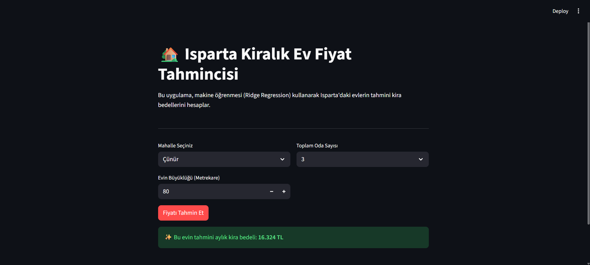

# 🏡 Isparta Kiralık Ev Fiyat Tahmincisi (House Price Prediction)

Bu proje, Isparta'daki kiralık ev piyasasını analiz eden ve makine öğrenmesi algoritmaları kullanarak evlerin tahmini aylık kira bedellerini hesaplayan **uçtan uca (end-to-end) bir veri bilimi ve makine öğrenmesi** çalışmasıdır. 

Özellikle Süleyman Demirel Üniversitesi'nin etkisiyle oldukça dinamik olan yerel kiralık ev piyasası modellenmiş ve son kullanıcılar için interaktif bir Streamlit web uygulamasına dönüştürülmüştür.



## 🚀 Proje Adımları ve Metodoloji

Proje, standart bir veri analitiği yaşam döngüsüne uygun olarak geliştirilmiştir:

1. **Veri Temizleme (Data Cleaning):** - Eksik veri (NaN) içeren satırlar temizlendi.
   - Metin tabanlı "Fiyat" bilgileri (örn: "15.000 TL") sayısal veri tiplerine (Integer/Float) dönüştürüldü.
   - "3+1", "Stüdyo" gibi formatlardaki oda sayıları matematiksel olarak toplanıp sayısallaştırıldı (`Toplam_Oda`).

2. **Keşifsel Veri Analizi ve Aykırı Değer Yönetimi (EDA & Outliers):**
   - Hatalı girilen metrekare verileri (örn: 2 m² gibi mantıksız değerler) istatistiksel olarak filtrelendi (Min 15 m² eşiği uygulandı).

3. **Özellik Mühendisliği (Feature Engineering):**
   - "Boyut Laneti"ni (Curse of Dimensionality) önlemek amacıyla, 30'dan az ilana sahip olan düşük frekanslı mahalleler **"Diğer"** kategorisi altında gruplandı.
   - Kategorik mahalle verileri, Çoklu Bağlantı (Multicollinearity) riskini önlemek için `drop_first=True` parametresiyle **One-Hot Encoding** işleminden geçirildi.
   - Veriler modellere verilmeden önce `StandardScaler` ile ölçeklendirildi (Scaling).

4. **Model Eğitimi ve Optimizasyonu:**
   - Linear Regression, Ridge, Lasso ve ElasticNet algoritmaları eğitilerek performansları karşılaştırıldı.
   - **5-Fold Cross Validation (Çapraz Doğrulama)** ve Hiperparametre optimizasyonu (`RidgeCV`, `LassoCV`, `ElasticNetCV`) sonucunda en başarılı model seçildi.
   - **Şampiyon Model:** RidgeCV (R² Skoru: ~0.62 | RMSE: ~4032 TL). 
   - *Not: Sadece metrekare, oda sayısı ve mahalle gibi sınırlı (3 adet) bağımsız değişkenle piyasa varyansının %62'sinin açıklanabilmesi başarılı bir sonuç olarak değerlendirilmiştir.*

## 🛠️ Kullanılan Teknolojiler (Tech Stack)

- **Programlama Dili:** Python
- **Veri Manipülasyonu & Analizi:** Pandas, NumPy
- **Makine Öğrenmesi (Machine Learning):** Scikit-learn (Ridge, Lasso, ElasticNet, StandardScaler, Cross-Validation)
- **Model Deployment (Canlıya Alma):** Streamlit, Joblib

## 💻 Uygulamayı Kendi Bilgisayarında Çalıştırma

Projeyi lokal ortamınızda çalıştırmak için aşağıdaki adımları izleyebilirsiniz:

Repoyu bilgisayarınıza klonlayın:
```bash
git clone https://github.com/tugrulsc1907-gif/isparta-house-price-prediction.git
```

2.Gerekli kütüphaneleri yükleyin:
```bash
pip install pandas numpy scikit-learn streamlit joblib
```

3.Uygulamayı başlatın:
```bash
streamlit run app.py
```
